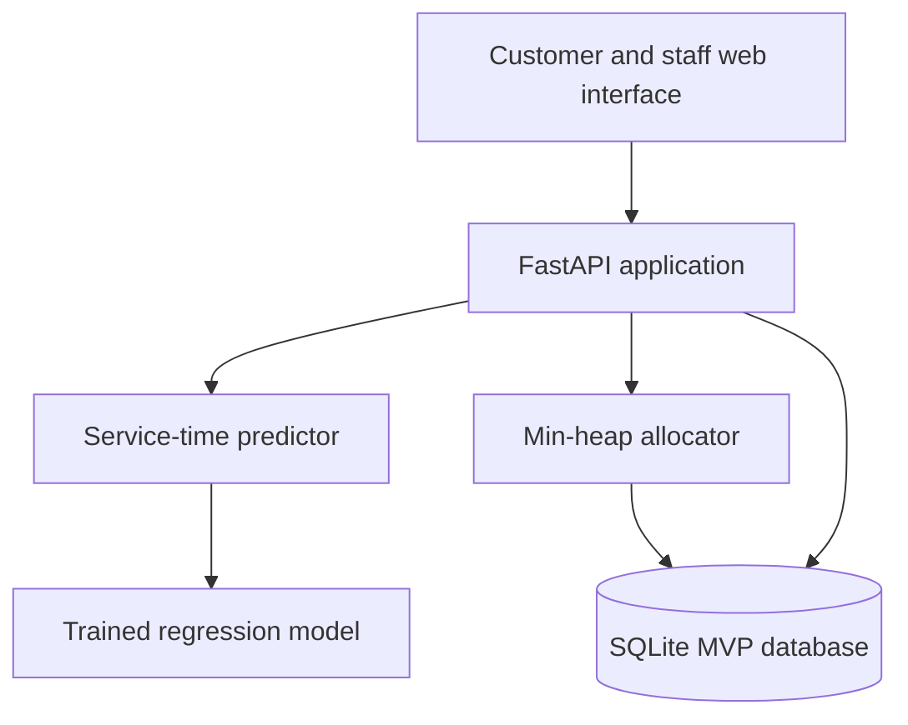
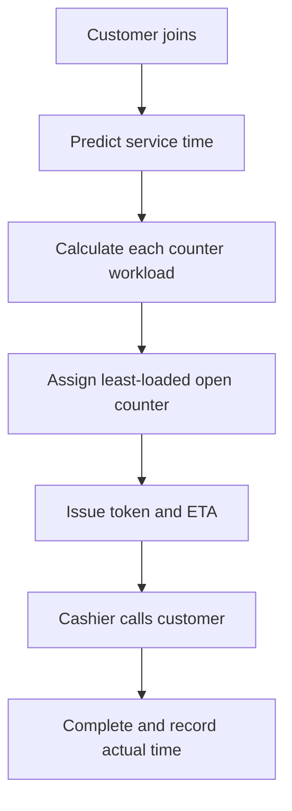
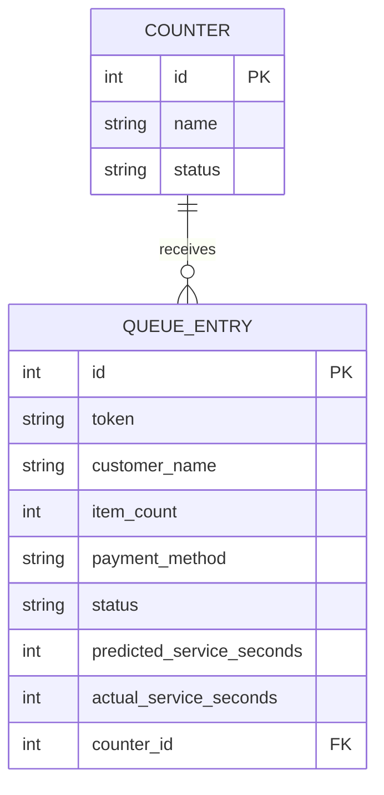

# SmartQueue Software Requirements Specification

## 1. Purpose

SmartQueue is a retail checkout queue-management prototype. It predicts checkout
service time, assigns each arriving customer to the least-loaded open counter,
shows an estimated wait, and provides staff with a live operating dashboard.

## 2. Problem statement

Manual checkout selection can create uneven queues: one counter is overloaded
while another is underused. Customers cannot reliably estimate their wait, and
managers lack live evidence for deciding when to open or close a counter.

## 3. Scope

### In scope for the MVP

- Customer check-in with basket size and payment method.
- Checkout-time prediction with an ML model or explainable fallback.
- Min-heap-based assignment to the least-loaded open counter.
- Digital token, assigned counter, and estimated wait.
- Cashier controls to call and complete a customer.
- Manager dashboard for workload, queue state, and basic statistics.
- Reproducible synthetic dataset and model-comparison pipeline.

### Outside the first MVP

- Product barcode scanning and payment processing.
- Facial recognition or storage of sensitive customer data.
- Guaranteed commercial success or loss calculations without real business data.
- Production authentication, multi-store deployment, and notification gateways.

## 4. Actors

| Actor | Main actions |
|---|---|
| Customer | Join queue, obtain token, view assignment and estimated wait |
| Cashier | Call next customer, complete checkout |
| Store manager | Monitor load, open/close counters, inspect statistics |
| Research team | Collect anonymised observations, train and evaluate models |

## 5. Functional requirements

- **FR-01:** The system shall allow a customer to enter basket size and payment method.
- **FR-02:** The system shall predict service time for each checkout.
- **FR-03:** The system shall assign a customer only to an open counter.
- **FR-04:** The allocator shall select the counter with the lowest predicted workload.
- **FR-05:** The system shall issue a unique token for every queue entry.
- **FR-06:** A counter shall serve at most one customer at a time.
- **FR-07:** A counter with active assignments shall not be closed.
- **FR-08:** The dashboard shall display waiting, serving, completed, and throughput metrics.
- **FR-09:** The system shall record predicted and actual service durations for evaluation.
- **FR-10:** The prototype shall expose API documentation for testing and demonstration.

## 6. Non-functional requirements

- **Performance:** Normal dashboard and check-in requests should complete within one second locally.
- **Usability:** The dashboard must be usable on laptop and mobile-width screens.
- **Reliability:** Database writes use transactions and preserve valid queue states.
- **Maintainability:** Prediction, allocation, persistence, and interface code are separated.
- **Privacy:** The prototype requires no phone number, payment details, or biometric information.
- **Explainability:** The selected ML model and validation metric must be documented.

## 7. Architecture

SQLite is used for the portable demonstration. The persistence module can later
be replaced with PostgreSQL without changing the user flow.

## 8. Core workflow

## 9. Data model

## 10. Acceptance criteria for Friday review

- The dashboard opens locally without manual database setup.
- Three counters appear and can be opened or closed safely.
- A customer receives a token and workload-based counter assignment.
- Staff can call and complete the customer.
- Statistics update after each action.
- A demonstration dataset and trained model can be generated reproducibly.
- SRS, architecture, algorithm, testing approach, and roadmap are documented.

